## Web Service LLM:

An API that extracts meaningful attributes from a HTML block of an e-commerce website using an open source large langauge model and returns the relevant and meaningful information from the page in JSON format.

The steps are as follows, to complete this task.

1. First we create a block diagram of how the input, processing and ouptut flow.

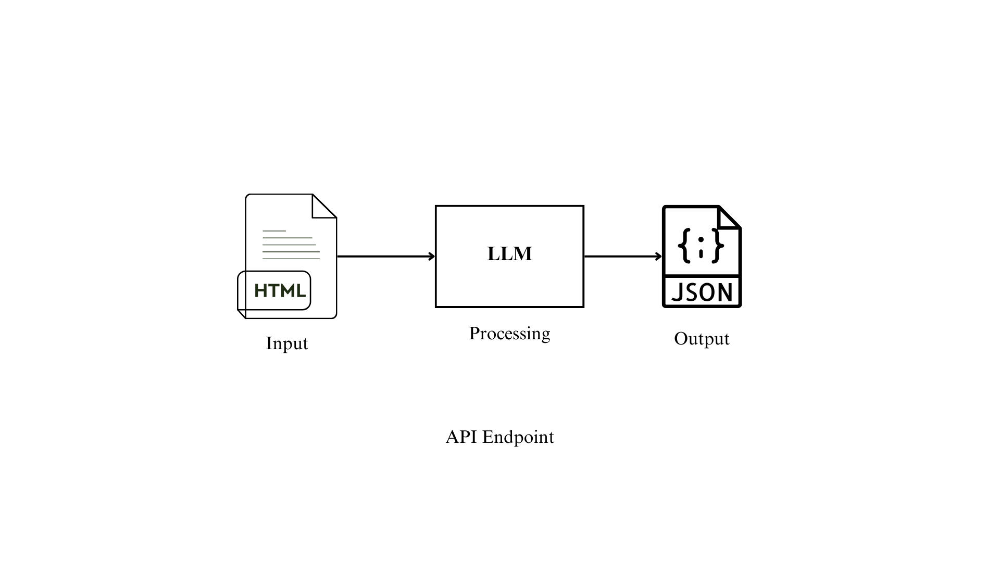       
<p>  </p> 
2. Create a virtual environment, since I have mini conda, I created a virtual env with the help of miniconda

```
conda create --name lang
conda activate lang  
```
to deactivate the virtual env:
```
conda deactivate
``` 

The lang virtual environment is activated and we install all the needed libraries in this environment. 

Now we can install all the needed files and packages.


3. For the LLM, I have chosen the open source Llama 3. It can be easily installed by downloading <a href="https://ollama.com/">Ollama</a>.

    Open the link and click on the download.

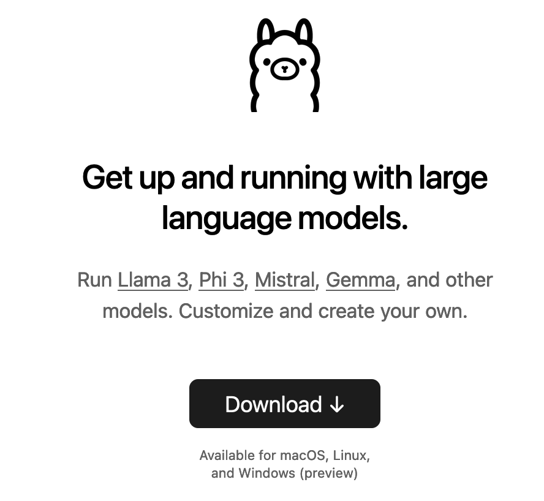  

<p>  </p>
Ollama consists of variety of LLM models, and I chose the Meta Llama 3, a family of models developed by Meta Inc. are new state-of-the-art , available in both 8B and 70B parameter sizes (pre-trained or instruction-tuned).    
<p> </p>
For this project, I have chosen the Llama3 8b and installed it locally in my machine of 8GB RAM.  

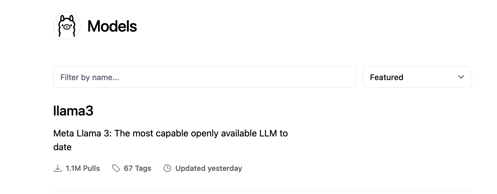 
<p>  </p>
 5. To download the Llama 3, paste the code in the terminal:

```
 ollama run llama3
 ``` 

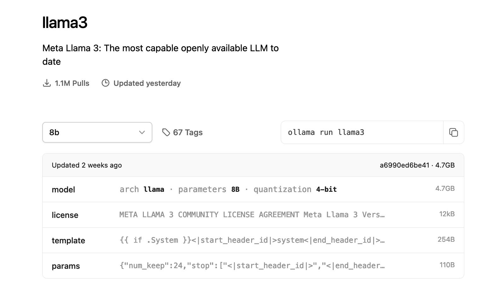  
<p>  </p>

6. Then the Llama 3:8b model has been installed.

7. Now for creating the API, I use the FastAPI:

```
conda config --add channels conda-forge 
conda config --set channel_priority strict
conda install fastapi 
```

Other dependencies are also downloaded such as:

```
conda install uvicorn
conda install requests
conda install beautifulsoup4
```
8. Now in my local machine, first the Ollama app is run. 

9. Then the test.py file is opened and run by typing the command in the terminal:
```
conda run uvicorn main:llm --reload
```


   The  index route opens automatically at http://127.0.0.1:8000

10. Now in the browser we paste the url link: 

http://127.0.0.1:8000/llma  which provide the product name, description and price in JSON format.

 The working of this code is that, I have manually chosen a website that can be scraped for content: https://webscraper.io/test-sites 
 
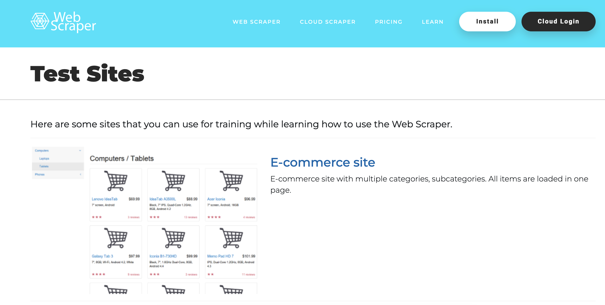  

<p>  </p>
I used E-commerce site with AJAX pagination links, the E-commerce site with multiple categories, subcategories. Dynamic links that use data without reloading the page for pagination, such that in this program the scraped data, input_html  is different after every execution.  

This code works for the static e-commrce website mentioned in this website.

For the outputs:

The input html content generated by the webscraping code is:

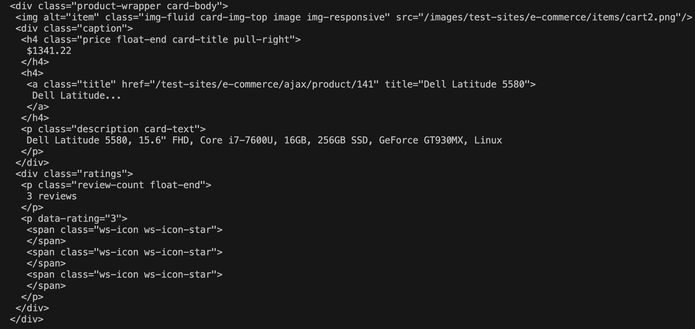       
<p>  </p>

Then after the steps are done to run the API, as mentioned above, We get:

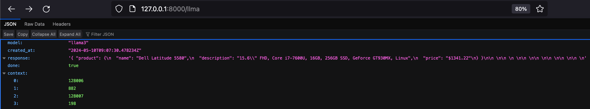       
<p>  </p>

Using the SwaggerUI, by pasting the URL http://127.0.0.1:8000/docs

We get to this page where we can test the API as well.

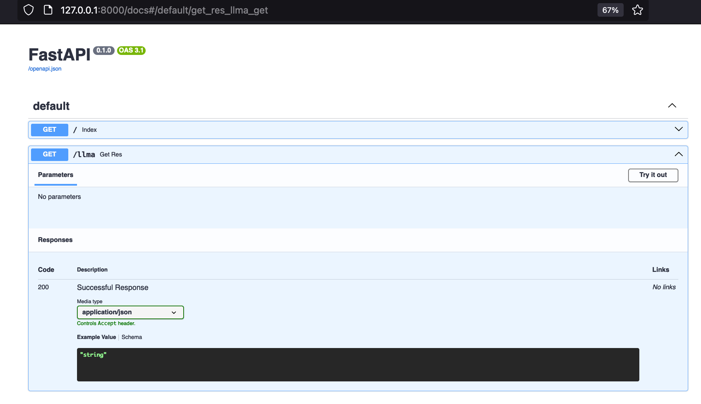       
<p>  </p>

Click on the Try it out and we see:

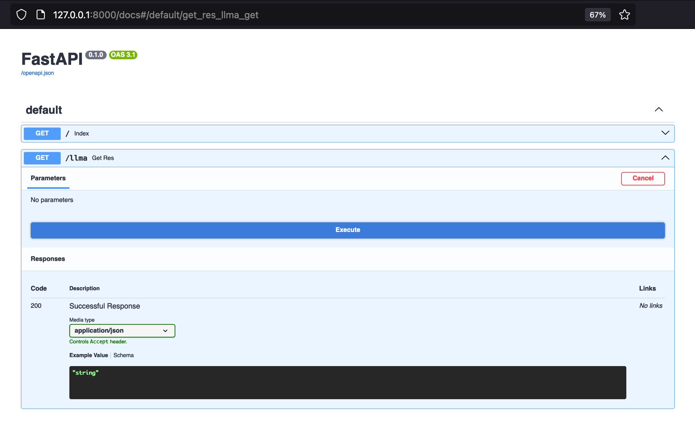       
<p>  </p>

Click on Execute and we get:

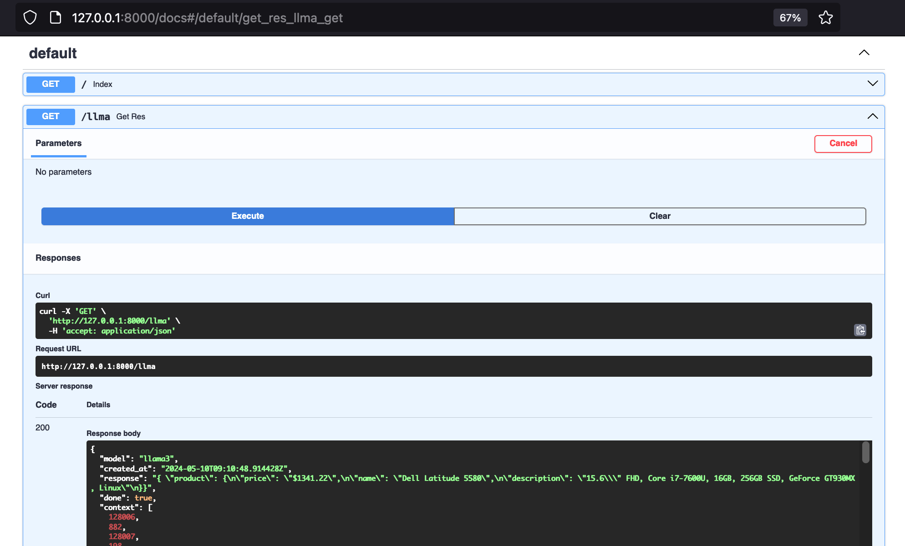       
<p>  </p>

So to sum it up, we can see the block diagram:

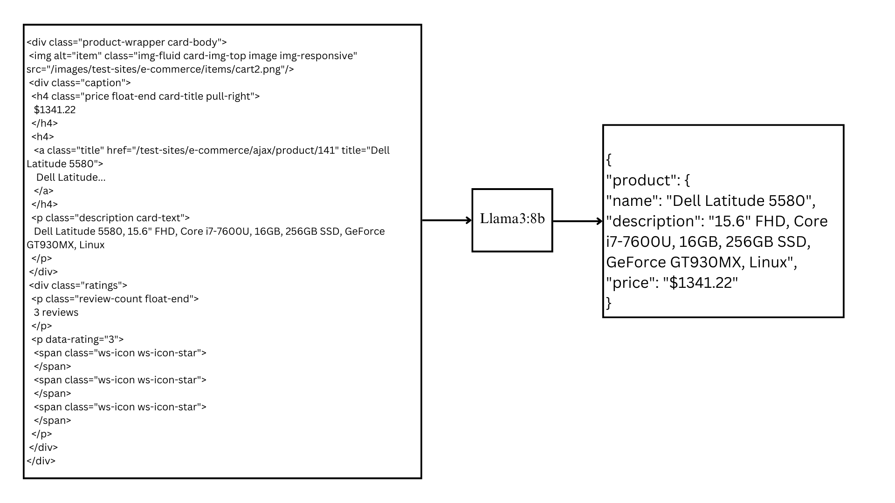       
<p>  </p>


In this way I have created an API that extracts meaningful attributes from a HTML block of an e-commerce website using an open source large langauge model Llama 3:8b which returns the relevant and meaningful information (product name, description and price) from the page in JSON format.


For another example, let us do the same steps to get:

Input:

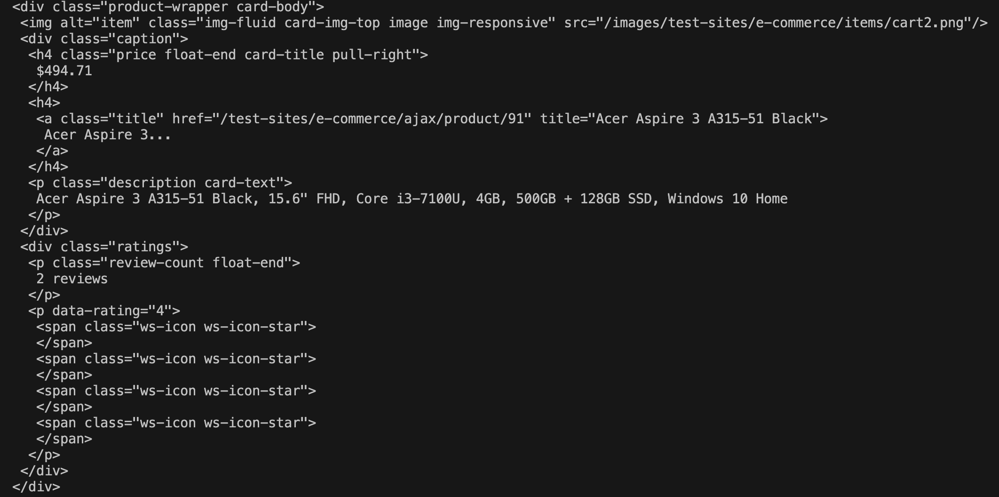       
<p>  </p>
Output:

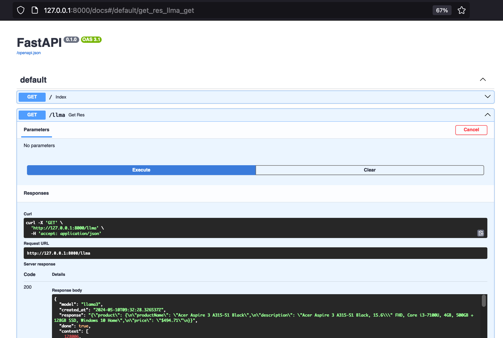       
<p>  </p>