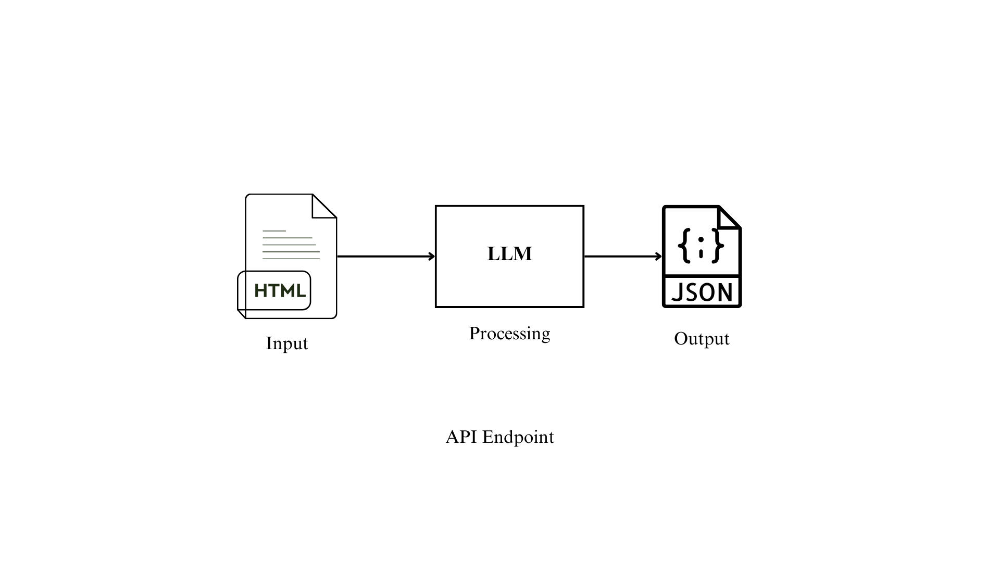
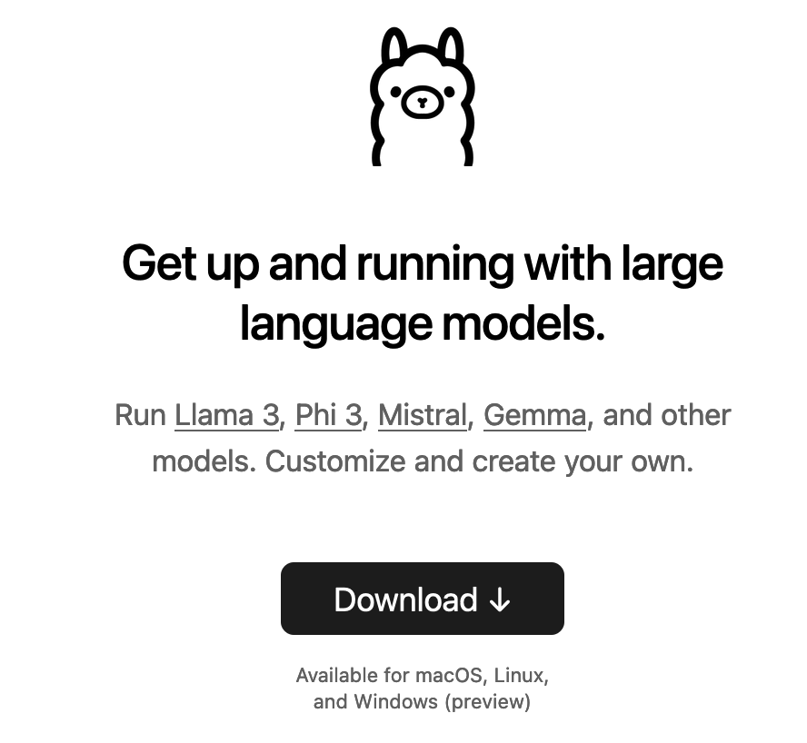
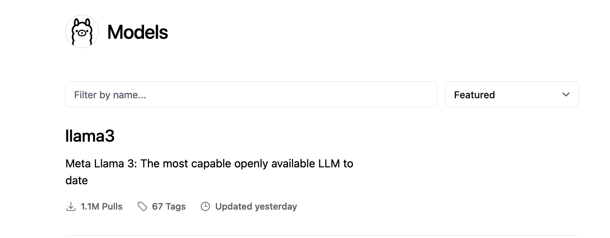
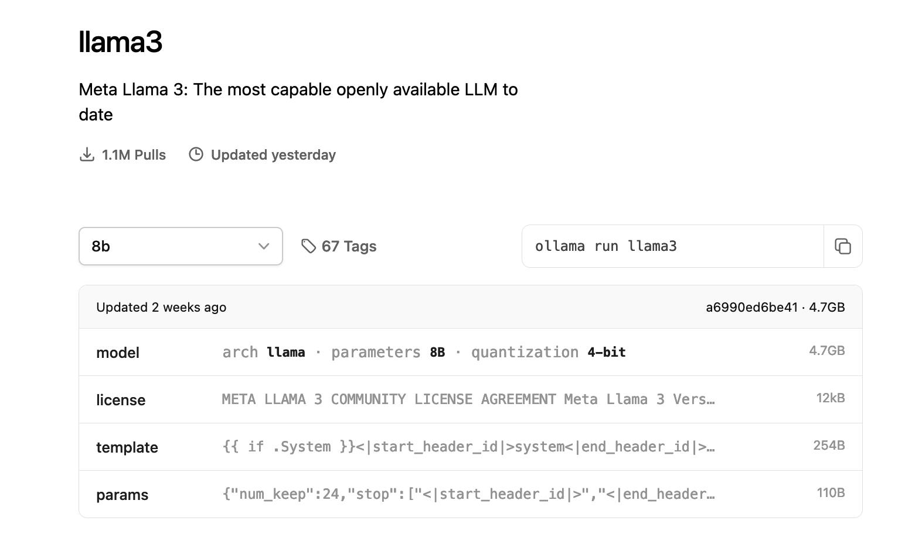

## Web Service LLM:

An API that extracts meaningful attributes from a HTML block of an e-commerce website using an open source large langauge model and returns the relevant and meaningful information from the page in JSON format.

The steps are as follows, to complete this task.

1. First we create a block diagram of how the input, processing and ouptut flow.

 
2. Create a virtual environment, since I have mini conda, I created a virtual env with the help of miniconda
- conda create --name lang
- conda activate lang
to deactivate the virtual env:
-  conda deactivate 

Now we can install all the needed files and packages.

3. For the LLM, I have initially chosen the open source Llama 3. It can be easily installed by downloading <a href="https://ollama.com/">Ollama</a>.

Open the link and click on the download.

Ollama consists of variety of LLM models, and I chose the Meta Llama 3, a family of models developed by Meta Inc. are new state-of-the-art , available in both 8B and 70B parameter sizes (pre-trained or instruction-tuned).

 5. To download the Llama 3, paste the code in the terminal:
 ollama run llama3 
 

6. Then the Llama 3 model has been installed

7. Now for creating the API, I use the FastAPI:

- conda config --add channels conda-forge 
- conda config --set channel_priority strict
- conda install fastapi 

8. 